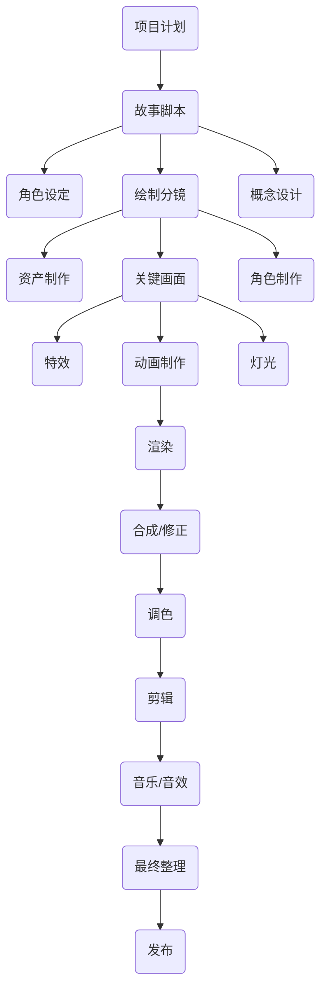

# 动画流程
## 动画项目工作流
以下是工作室的动画项目工作流

```mermaid
flowchart TD

A(项目计划)-->B(故事脚本)
B-->C(角色设定)
B-->D(绘制分镜)
B-->E(概念设计)

D-->F(资产制作)
D-->G(关键画面)
D-->H(角色制作)

G-->I(特效)
G-->J(动画制作)
G-->K(灯光)

J-->L(渲染)
L-->M(合成/修正)
M-->N(调色)
N-->O(剪辑)
O-->P(音乐/音效)
P-->Q(最终整理)
Q-->R(发布)
```
