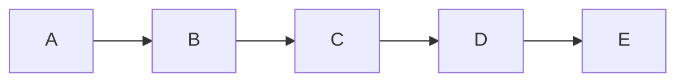
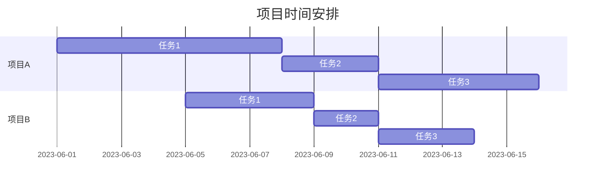

# Obsidian基础使用教学

这是一篇针对markdown基础语法的obdisian教学

## 一、Markdown语法

Markdown是一种轻量级的标记语言，目前在许多平台上被广泛使用，如GitHub、知乎、CSDN、chatgpt和简书等平台和专栏。它提供了一种简单、易于使用的语法，用于格式化文本并添加基本的结构和样式。

Markdown的文件后缀名为.md。

Obsidian是一款Markdown编辑器，其支持Markdown基本语法如下：

### 1.1 标题

井号#后面加一个空格写标题

```
# 一级标题
## 二级标题
### 三级标题
#### 四级标题
##### 五级标题
###### 六级标题
```

## 二级标题
### 三级标题
#### 四级标题
##### 五级标题
###### 六级标题

### 1.2 字体

- **加粗**

要加粗的文字左右分别用两个`*`号包起来

- *斜体*

要倾斜的文字左右分别用一个`*`号包起来

- ***斜体加粗***

要倾斜和加粗的文字左右分别用三个`*`号包起来

- ~~删除线~~

要加删除线的文字左右分别用两个`~~`号包起来

### 1.3 引用

在引用的文字前加>即可。引用也可以嵌套，如加两个>>三个>>>
```
>这是引用的内容
>>这是引用的内容
>>>>>>>>>>这是引用的内容
```
>这是引用的内容
>>这是引用的内容
>>>>>>>>>>这是引用的内容

### 1.4 分割线

三个或者三个以上的 - 或者 * 都可以。
```
----
***
*****
```
----
***
*****

### 1.5 图片

```


图片alt就是显示在图片下面的文字，相当于对图片内容的解释。
（Obsidian本体不支持图片标题显示）
图片title是图片的标题，当鼠标移到图片上时显示的内容。title可加可不加
```

!!! warning "注意"
    在Obsidian里图片可以直接拖入编辑器中，就像你在word或者其他文本编辑软件一样，Obsidian会自动将你的图片放到你的仓库附加数据下，并创建一个图像链接，但是请注意，这个图片如果不是网络图片，是**无法打包**到Markdwon文件里的，markdown文件是**纯文本格式**，如果你要分享图片**请务必将附加数据一起分享**！

下图是网络分享的图片


### 1.6 链接

#### 1.6.1 内部链接

将其他Obsidian的文件直接拖入进来会创建一个内部链接，如下：

```
[[OpenGL安装与使用]]

文件名字用两个方括号抱起来，点击可以跳转至该文件
```

由于这种方式只能在内部仓库中跳转，所以这里不放示例。

#### 1.6.2 超链接

语法：

```
[超链接名](超链接地址 "超链接title")
title可加可不加
```

示例：

```
[简书](http://jianshu.com)
[百度](http://baidu.com)
```

[简书](http://jianshu.com)
[百度](http://baidu.com)

### 1.7 列表

#### 1.7.1 无序列表

语法：  
无序列表用 - + * 任何一种都可以

```
- 列表内容
+ 列表内容
* 列表内容

注意：- + * 跟内容之间都要有一个空格
```

效果如下：

- 列表内容
- 列表内容
- 列表内容

#### 1.7.2 有序列表

语法：  
数字加点

```
1. 列表内容
2. 列表内容
3. 列表内容

注意：序号跟内容之间要有空格
```

效果如下：

1. 列表内容
2. 列表内容
3. 列表内容

#### 1.7.3 列表嵌套

**上一级和下一级之间敲三个空格即可**

- 一级无序列表内容
    
    - 二级无序列表内容
    - 二级无序列表内容
    - 二级无序列表内容
- 一级无序列表内容
    
    1. 二级有序列表内容
    2. 二级有序列表内容
    3. 二级有序列表内容

1. 一级有序列表内容
    
    - 二级无序列表内容
    - 二级无序列表内容
    - 二级无序列表内容
2. 一级有序列表内容
    
    1. 二级有序列表内容
    2. 二级有序列表内容
    3. 二级有序列表内容

#### 1.7.4 任务列表

语法：- [ ]

```
- [x] 写剧本
- [ ] 画分镜
- [ ] 概念设计
- [ ] 建模
```

- [x] 写剧本
- [ ] 画分镜
- [ ] 概念设计
- [ ] 建模


### 1.8 表格

语法：

```
表头|表头|表头
---|:--:|---:
内容|内容|内容
内容|内容|内容

第二行分割表头和内容。
- 有一个就行，为了对齐，多加了几个
文字默认居左
-两边加：表示文字居中
-右边加：表示文字居右
注：原生的语法两边都要用 | 包起来。此处省略
```

示例：

```
姓名|技能|排行
--|:--:|--:
刘备|哭|大哥
关羽|打|二哥
张飞|骂|三弟
```

姓名|技能|排行
--|:--:|--:
刘备|哭|大哥
关羽|打|二哥
张飞|骂|三弟

### 1.9 代码

语法：  
单行代码：代码之间分别用一个反引号包起来

```go
    `代码内容`
```

代码块：代码之间分别用三个反引号包起来，且两边的反引号单独占一行

```
(```)
  代码...
  代码...
  代码...
(```)
```

> 注：为了防止转译，前后三个反引号处加了小括号，实际是没有的。这里只是用来演示，实际中去掉两边小括号即可。

示例：

单行代码

```go
`create database hero;`
```

代码块

```kotlin
(```)
    function fun(){
         echo "这是一句非常牛逼的代码";
    }
    fun();
(```)
```

效果如下：

单行代码

`create database hero;`

代码块

```kotlin
function fun(){
  echo "这是一句非常牛逼的代码";
}
fun();
```

  
### 1.10 流程图

这里采用mermaid流程图，mermaid是一个很强大的流程图语言，可以画出多种流程图。

````
graph LR
    A-->B
    B-->C
    C-->D
    D-->E

gantt
    dateFormat  YYYY-MM-DD
    title 项目时间安排

    section 项目A
    任务1           :a1, 2023-06-01, 7d
    任务2           :a2, after a1, 3d
    任务3           :a3, after a2, 5d

    section 项目B
    任务1           :b1, 2023-06-05, 4d
    任务2           :b2, after b1, 2d
    任务3           :b3, after b2, 3d

````

效果如下：






### 1.11 外链

[Markdown基本语法 - 简书 (jianshu.com)](https://www.jianshu.com/p/191d1e21f7ed)
[Markdown超级教程 Obsidian版 - 秃秃的小屋 - Obsidian Publish](https://publish.obsidian.md/csj-obsidian/0+-+Obsidian/Markdown/Markdown%E8%B6%85%E7%BA%A7%E6%95%99%E7%A8%8B+Obsidian%E7%89%88)

## 二、更换主题

Obsidian默认的主题显示比较不美观，所以建议更换主题，具体步骤如下

### 2.1 下载主题

左下角点击设置按钮，依次点进**外观**->**主题**->**管理**，这里面有很多主题风格，而我这里推荐**Blue Topaz**风格。

### 2.2 主题设置

在安装好主题后，我们还可以用一个插件来自定义具体的风格，点击**第三方插件**，**关闭安全模式**，这时就能看到**社区插件市场**，点击**浏览**，我们可以看到Obsidian众多的第三方插件支持（需要挂代理）。

搜索**Style Settings**，找到这个插件并安装，安装好后，点击**启用**，这个插件就被我们启用了，Obsidian的所有插件安装完后都是需要手动启用的。

点进**Style Settings**，点开**Blue Topaz Theme**，这里我们可以调整配色，比如可以调整**整体配色**，我这里选的配色是榛子巧克力，这里可以自己试试自己喜欢的配色。

## 三、插件

Obsidian有众多的插件支持，这里我选择几个比较重要方便的插件介绍，由于插件库众多，可能我还有很多的优秀插件没有触及到，因此这里介绍的比较简单。

### 3.1 Edting Toolbar

这个插件将markdown的各项语法都集成到了一个工具栏上，点一下图标就可以实现对应功能，跟在word里的体验差不多，很适合新手。

### 3.2 Excalidraw

将Excalidraw集成在Obsidian页面里，除了绘制延迟稍大之外，其他基本没有区别，并且支持将Obsidian内的文件拖进Excalidraw或者将Excalidraw文件拖进其他文件作为内部链接。

### 3.3 Recent Files

左下角可以查看最近使用过的文件

### 3.4 Calendar

日历插件，可以创建日记等


